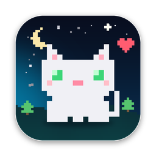
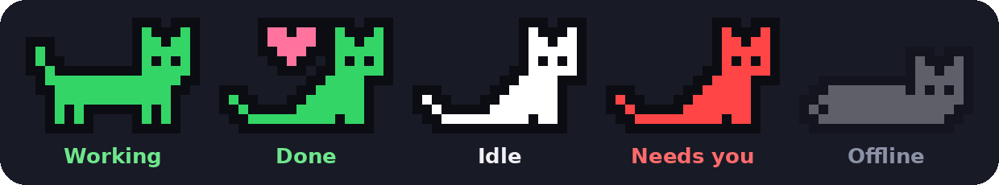

<h1 align="center">Purr</h1>

A little pixel cat in your Mac menu bar that shows what the Claude desktop app is doing (Chat and Cowork).

**[Download the latest Purr.zip](https://github.com/fyj-creator/Purr/releases/latest/download/Purr.zip)**

You need an Apple Silicon Mac (M1 or newer) with macOS 13 or later, and the Claude desktop app.

## What the cat means

| | Cat | Meaning |
|---|---|---|
|  | **Yellow, walking** | Claude is working (with a short status and timer) |
|  | **Green with a heart** | Claude just finished (shown for 10 seconds) |
|  | **White** | Claude is open and idle |
|  | **Red** | Claude is waiting for your permission |
|  | **Faint, asleep** | Claude is closed, or Purr has no access yet |

Click the cat to open its panel: a starry night scene, what Claude is doing right now, today's stats and recent steps.

## How to open

Prefer a one-page printable guide? Get the **[How to open PDF](Purr-How-to-open.pdf)**.

### 1. Unzip and move it

Double-click **Purr.zip**, then drag **Purr** into your **Applications** folder.

### 2. Open it the first time

Purr isn't from the App Store, so your Mac asks you to confirm it once.

1. Double-click **Purr** in Applications. A warning says it can't be verified. Click **Done**, not "Move to Trash".
2. Open **System Settings → Privacy & Security** and scroll down to **Security**.
3. Next to "Purr was blocked…", click **Open Anyway**, then **Open Anyway** again. Enter your password or use Touch ID.

On macOS 13 or 14 you can instead right-click Purr → **Open** → **Open**. You only do this once.

### 3. Let Purr see Claude

When asked, click **Open System Settings**. Otherwise go to **System Settings → Privacy & Security → Accessibility** and turn on **Purr**. Then click the cat in the menu bar once.

Purr reads the Claude window the way a screen reader does. It never clicks, types or sends anything, and nothing leaves your Mac.

### 4. Find the cat

Look at the top-right of your screen. Use the **⚙︎** button in the panel to turn on **Open at login**, notifications, or sounds: a bell when Claude finishes and a meow when it needs you.

## Updating

Click the cat, then the **↻** button at the bottom of the panel (or **⚙︎** → **Check for updates…**). If a newer version exists, press **Install**. Purr downloads it, checks it, replaces itself and reopens.

## Troubleshooting

- **Can't see the cat?** Your menu bar may be full; on MacBooks with a notch, extra icons get hidden. Hold **⌘** and drag other icons to make room, or turn off "Show status text in menu bar" in ⚙︎.
- **Cat stays faint?** Make sure Claude is open. Then check Accessibility: if Purr is on but still faint, remove it with **–**, add it again with **+**, and reopen Purr.
- **Quit or remove:** click the cat → ⚙︎ → **Quit Purr**. To remove it, quit it and drag Purr from Applications to the Trash.
- **Your data:** stats and recent steps stay on your Mac only, and reset every day at midnight.

## Credits

The meow that plays when Claude needs you is adapted from ["Meow normalized.opus"](https://commons.wikimedia.org/wiki/File:Meow_normalized.opus) on Wikimedia Commons (original recording "Meow.ogg" uploaded by Dcrosby at English Wikipedia, normalised version by Okterakt), licensed under [Creative Commons Attribution-ShareAlike 3.0 Unported](https://creativecommons.org/licenses/by-sa/3.0/). Changes: background noise removed, trimmed, faded and volume-adjusted. The adapted sound inside the app (`needs_you.wav`) is shared under the same licence.

The bell that plays when Claude finishes is a sound effect from [Uppbeat's Ding collection](https://uppbeat.io/sfx/category/notifications/ding), edited (softened, cut to a single strike and volume-adjusted), used under the Uppbeat licence. It is not covered by the Creative Commons licence above and may not be extracted or redistributed on its own.

Purr is an independent hobby project. It is not made or endorsed by Anthropic.
